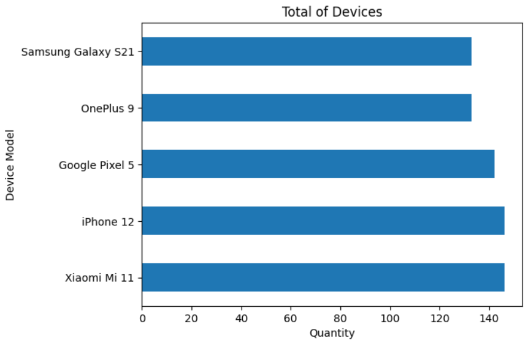
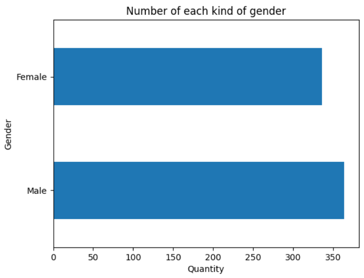
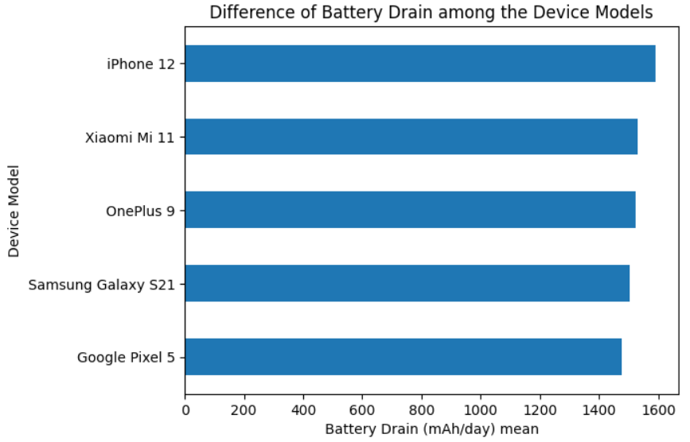
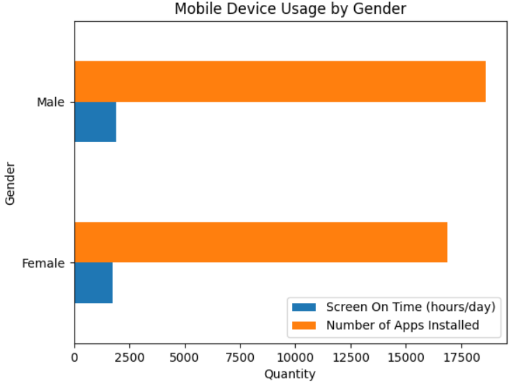
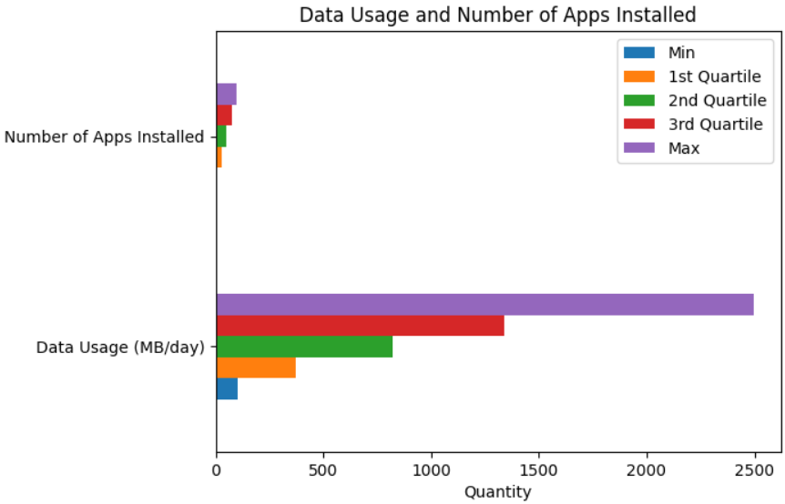

# Mobile Device Usage

## 1. Introduction

In the last few years the usage of mobile devices grew considerably. Big companies invest a lot of money to develop apps and solutions for mobile users, because they generate a good financial return to these companies. Nowadays, most web users usually use their smartphones to access websites and mobile apps. There are nice business ideas operating in the “mobile world”, like startups and big techs. Many traditional banking institutions had to adapt to this new market, as a new business model focused on digital use has emerged. These digital banks are called “fintechs”.

So, in summary, mobile devices have an important role in the current scenario. They can be used for several purposes, such as fun, health, work, education, etc. And this project was developed to analyze a <a href="https://www.kaggle.com/datasets/valakhorasani/mobile-device-usage-and-user-behavior-dataset" target="_blank" rel="noopener noreferrer">dataset</a> about mobile device usage from Kaggle. This project was developed using Pandas to treat the data and to plot charts to analyze them.

### 1.1 Analysis points

Through this project some questions will be answered. Such as:

<ul>
  <li>What’s the preferred device model? And which operating system this device uses? How can this impact the tech market?</li>
  <li>Are there more men or women using mobile devices? Is the difference big or small? Why?</li>
  <li>What’s the battery drain (mAh/day) mean and its standard deviation according to the preferred device model? And how can this impact the environment?</li>
  <li>Do men usually spend more time using mobile devices than women? Or do women use them more? Why?</li>
  <li>What’s the maximum data usage (MB/day) and their relation with the number of apps installed? For what reason could a person use so much data per day?</li>
  <li>What’s the mean of age among the users? Who spends more time using mobile devices, the oldest or the youngest person? And what operating system do they prefer?</li>
  <li>Who has the biggest and smallest user behavior class? Are they men or women?</li>
</ul>

## 2. Exploring the data

### 2.1 Preferred device model and operating system

About the preferred device and operating system (OS), there is a tie between Xiaomi Mi 11 and iPhone 12. The first is based on the Android OS and the second uses the IOS, which is only used by Apple smartphones. There are one hundred and forty-six people using each device. But there are other devices analyzed in this database, like Google Pixel 5, OnePlus 9 and Samsung Galaxy S21, which belong to other companies.

  

 

Through the graph it’s possible to see the usage difference among the smartphones analyzed. The Google Pixel 5 device reached a small difference in comparison to its competitors. Even so, the Apple and Xiaomi’s devices have a more present usage than the others, which includes the Samsung one.

According to the <a href="https://www.globaldata.com/companies/top-companies-by-sector/technology-media-and-telecom/global-consumer-electronics-companies-by-market-cap/#:~:text=The%20United%20States%2Dbased%20Apple,increase%20of%207.8%25%20over%20FY2021." target="_blank" rel="noopener noreferrer">Global Data</a> website, Apple is the current second largest electronics company and Samsung is the sixth one. However Xiaomi, which isn’t in the top ten, could compete against them.

But why did this happen? Apple and Xiaomi are both electronics companies, but they have different business rules and possibly different goals. In some countries, where products from both companies are sold, the public who consumes the Apple devices is different from the public who consumes the Xiaomi ones. Nowadays, smartphones are indispensable tools, but not many people can buy an expensive device, even knowing about its quality. So, some people prefer to buy a cheappier smartphone. Of course, the popularity of a product can be a big influence on the public mind, like a property which causes impact in a social way, status, for example.

And what kind of impacts can this cause on the market? Well, knowing about the competitive power between the two companies, Apple and Xiaomi, and the fact that, even Xiaomi was founded later than its competitor, the Chinese company is more present in some people's choices, it can grow and take a bigger piece of the market in the following years. Although companies like Samsung, which produced the lesser smartphone used and analyzed in this dataset, should analyze their enemies and their strengths and weaknesses, planning some strategies to compete by a bigger user public.

About the Apple status, this company is well positioned in the tech market and, since its foundation, Apple has been building customer loyalty all over the world. Some people only use Apple’s devices and don’t have the intention to switch to other brands. Nevertheless, Xiaomi, Samsung and the other electronic companies are still a threat to Apple, because every day new technologies (devices, software applications and solutions) are developed by several companies, which can have the same interests of Apple and different ones, too.

In some cases, trade disputes are influenced by governments. Apple is an American company, Xiaomi is a Chinese one and Samsung is a South Korean one. The US and China have shown competitiveness in the past, so this commercial fight among the companies can be influenced by political powers.

### 2.2 Gender which uses more mobile devices

The dataset analyzed brings gender data and enables the analysis about which gender, male or female, is using more mobile devices. There are some factors which can influence this aspect, such as the professional environment, community, customs and religion where these users are involved. The financial and educational capacities of each user can determine the opportunities of their mobile device usage behavior as well.

Looking at the next graph, it’s possible to see the difference between the number of male and female users. The dataset indicates a bigger number of men using mobile devices than women. Although, the difference can be considered small because there is a kind of balance between them.

  

 

Even so, the difference keeps there. Why? As it was described below, there are several factors which can influence this result, and a big one comes from social media usage. According to the <a href="https://www.oberlo.com/statistics/social-media-usage-by-gender" target="_blank" rel="noopener noreferrer">Oberlo</a> website, there is a study about this matter, which points out the fact that there are more men using social media than women.

Nowadays, social media are powerful tools used not only by common users, but by commercial companies, religious and governmental institutions and non-governmental organizations (NGOs). Social media are present all over the world and can be useful in different manners, like fun, chat, news, education, marketing, health, politics, etc.

There can be other reasons for this difference in the number of users between men and women. However, a more specialized research should be applied to explore the possibilities.

### 2.3 Battery drain mean of the preferred device model

Nowadays, the consumption of energy is a serious matter. There are many companies looking for ways to generate or reuse energy sources, especially those renewables, like the sun. Big investments have been applying to extract energy from those sources and to keep them alive. And knowing the massive use of mobile devices by the mondial human population in general, it’s interesting to think about the battery drain caused by them.

So, based on the dataset used in this project, it was calculated the mean and the standard deviation of the both preferred device models, Xiaomi Mi 11 and iPhone 12. The mean and standard deviation of the Xiaomi Mi 11 in mAh/day is, respectively, 1528.88 and 821.44. The mean and standard deviation of the iPhone 12 in mAh/day is, respectively, 1589.51 and 817.18.

  

 

Through the results it’s possible to realize the difference of mean and standard deviation between the two devices. At a first look, this difference isn’t big, but if it’s calculated based on mAh/year, not by day, the difference could impact on several factors, such as the consumer's choice when they’re buying a new device.

Although, the focus is to analyze how this battery consumption can impact on the environment. The battery drain rating of a mobile device can vary based on many factors. And, thinking about the environment's well-being, there is a necessity of renewable energy sources, because smartphones are tools, which require batteries to work, used with frequency all over the world. So, if those sources won’t be well cared for and explored, the environment can suffer in several ways, like pollution and exhaustion of those non renewable ones.

### 2.4 Mobile device usage by gender

It was said before that there are more men using more mobile devices than women, and according to a study pointed out by the <a href="https://www.oberlo.com/statistics/social-media-usage-by-gender" target="_blank" rel="noopener noreferrer">Oberlo</a> website, women spend more time using social media than men. However, there are many other possibilities for usage of smartphones, and, because of that, it was analyzed which gender spends more time using and has more apps installed on them. To do that, these two variables were summed by each gender.

  

 

The dataset indicates that men spend more time using and have more apps installed on mobile devices than women. Why? A focused research should be applied to find truthful evidence about the reason behind it. But, according to the <a href="https://pmc.ncbi.nlm.nih.gov/articles/PMC8200210/#:~:text=Overall%2C%20the%20literature%20shows%20that,the%20numbers%20of%20female%20gamers." target="_blank" rel="noopener noreferrer">National Library of Medicine</a> website, nowadays there are more men playing video games than women. The mobile gaming market grew from 2020 to 2023 year (<a href="https://sensortower.com/blog/state-of-mobile-gaming-2024" target="_blank" rel="noopener noreferrer">Sensor Tower</a>) and this can influence the two previous variables.

### 2.5 Relation between data usage and number of apps installed

There is a big concern by technology users nowadays about the capacity of storage in a device. Governments, companies, professionals and common users care about this. There are some solutions for this problem, and a popular one is storage in the cloud, which can make it easier for them. Although, is there a relation between the data usage (MB/day) and number of apps installed on a smartphone?

  

 

Answering the previous question, yes, there can be a relation between these two variables. Through the chart it’s possible to see a linear progression when the data is organized from the minimum to the maximum value. Please, note that when the number of apps installed grows, the data usage grows, as well. But why?

As it was pointed out before, the storage in the cloud can be a great ally of different kinds of users. Even so, there are a lot of mobile app options in the market for several purposes, and they can be considered “light” or “heavy”. This means that they may need less or more storage capacity. And depending on the purpose for what a mobile app was developed, it can influence its necessities. For example, a mobile game has a different way to store its data, especially those multiplayer ones, than a to-do app.

### 2.6 User age, screen on time and preferred operating system

Analyzing the dataset it was calculated the user age mean, which is approximately 38.5 years old. The oldest users are 59 years old and the youngest ones are 18 years old. There is a difference among these results, intervals of almost 20 years.

The usage time by the oldest and youngest users was calculated based on the median of each of them. The usage time median of the oldest users is 5 hours/day and the youngest ones is 4 hours/day. So, in general, the oldest users used to use smartphones for more time than the youngest ones.

The preferred operating system between the oldest and youngest users is Android. To discover the reason behind it will be necessary to apply a specific research among them, taking into account their cultural, economic and academic differences.

